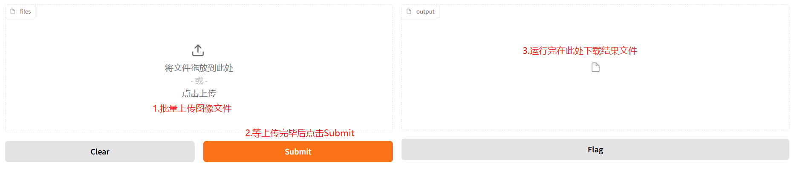

# 基于ViT微调的NSFW图像分类模型

## 算法来源
微调模型：[HuggingFace](https://huggingface.co/Falconsai/nsfw_image_detection)

## 环境安装
按照如下命令配置环境:
```bash
conda create -n nsfw python=3.10
pip install -r requirements.txt
```

## 使用说明
### Train  

```bash
python gather_img_to_txt.py  
CUDA_VISIBLE_DEVICES=0,1 python vit_finetune_nsfw.py
```

### Infenence
```bash
python afs_nsfw_img_cls.py
```
分类模型路径(nsfw_ckpt): /data/liuji/projects/nsfw_detection/run/nsfw_finetune_1e-4_224/checkpoint-495   
检测模型路径(detection_ckpt): /data/liuji/projects/nsfw_detection/yolo11x.pt   
以上路径在服务器：192.168.50.194 （user:liuji, pw:user01890)  

### Demo  
```bash
python demo.py
```

### 推理显存、推理速度、demo说明
速度与显存：在4090显卡上，测试一张单个人物的图像耗时0.15s， 显存占用1G  
demo说明：  

